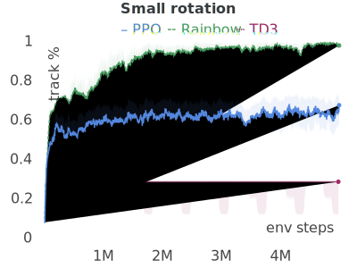
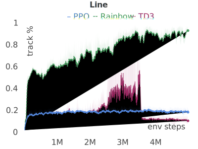
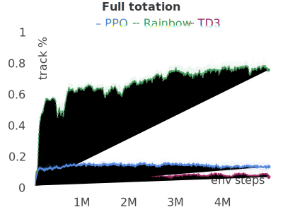
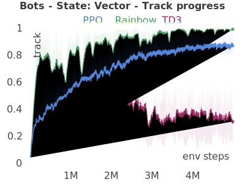
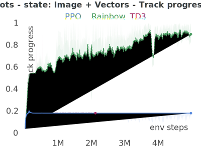

## Navigating Autonomous Vehicle at the Road Intersection with Reinforcement Learning

Michael Martinson, Alexey Skrynnik, Aleksandr I. Panov

## Abstract
In this paper, we consider the problem of controlling an intelligent agent that simulates the behavior of an unmanned car when passing a road intersection together with other vehicles.
We consider the case of using smart city systems, which allow the agent to get full information about what is happening at the intersection in the form of video frames from surveillance cameras.
The paper proposes the implementation of a control system based on a trainable behavior generation module.
The agent's model is implemented using reinforcement learning (RL) methods.
In our work, we analyze various RL methods (PPO, Rainbow, TD3), and variants of the computer vision subsystem of the agent.
Also, we present our results of the best implementation of the agent when driving together with other participants in compliance with traffic rules.

## This work
In this project, we consider the task of learning an agent that simulates a self-driving car that performs the task of passing through the road intersection.
As a basic statement of the problem, we consider a realistic scenario of using data from the agent's sensors (images from cameras within the field of view, laser rangefinders, etc.), data coming from video surveillance cameras located in complex and loaded transport areas, in particular at road intersections.

## Env CarIntersect

Our environment - CarIntersect simulate four way crossroad with some physics and bot cars.
Technical description in env folder [link](env/).

## Methods examples

| | | |
|:---:|:---:|:---:|
|  |  |  |
| TD3 on track Full rotate | Rainbow on track Full rotate | PPO on track Small rotation with bots |
| | | |
|  |  |  |
| TD3 on track Line | Rainbow with image as state on track Line  | PPO with image state on track Line |

## Convergence 

### State as a vector

| Small rotation | Medium rotation | Line | Full rotation |
|:---:|:---:|:---:|:---:|
|  |  |  |  |
 

### State as an image

| Small rotation | Medium rotation | Line | Full rotation |
|:---:|:---:|:---:|:---:|
|  |  |  |  | 

### With bot cars

| Vector state | Image state |
|:---:|:---:|
|  |  | 
