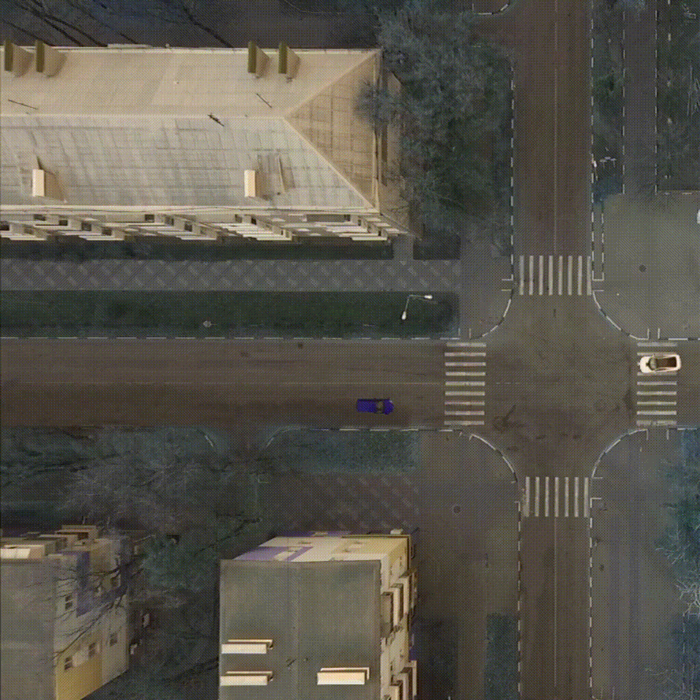

## Repo of experiments with CarIntersect env

This repo contains the implementation of RL agents: SAC, TD3, PPO, and wrapper for chainerRL.Rainbow.

The environment itself is in env folder. Open it for a more detailed description of the environment.

## Intro
Control architectures for mobile robotic systems and self-driving vehicles currently allow us to solve basic tasks for planning and self-driving in complex urban environments.
Often the methods used are based on pre-defined scenarios and rules of behavior, which significantly reduces the degree of autonomy of such systems.
One of the promising areas for increasing the degree of autonomy is the use of machine learning methods for automatically generating generalized object recognition procedures, including dynamic ones, in the external environment, and generating actions to achieve certain goals.

## This work
In this project, we consider the task of learning an intelligent agent that simulates a self-driving car that performs the task of passing through the road intersection.
As a basic statement of the problem, we consider a realistic scenario of using data from the agent's sensors (images from cameras within the field of view, laser rangefinders, etc.), data coming from video surveillance cameras located in complex and loaded transport areas, in particular at road intersections.

## Methods examples

| | | |
|:---:|:---:|:---:|
|  |  |  |
| TD3 on track Full rotate | Rainbow on track Full rotate | PPO on track Small rotation with bots |
| | | |
|  |  |  |
| TD3 on track Line | Rainbow with image as state on track Line  | PPO with image state on track Line |

## Charts

We made three series of experiments. 

### State as a vector

| Small rotation | Medium rotation | Line | Full rotation |
|:---:|:---:|:---:|:---:|
|  |  |  |  | 

